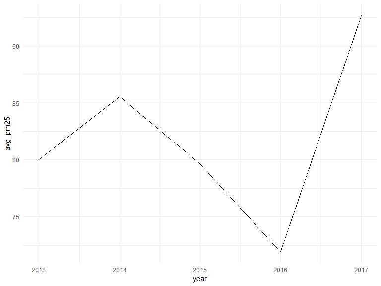
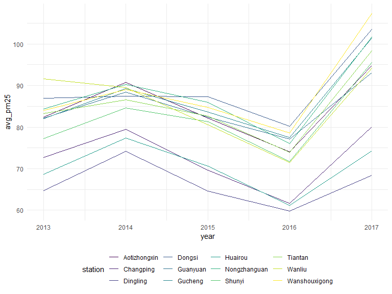
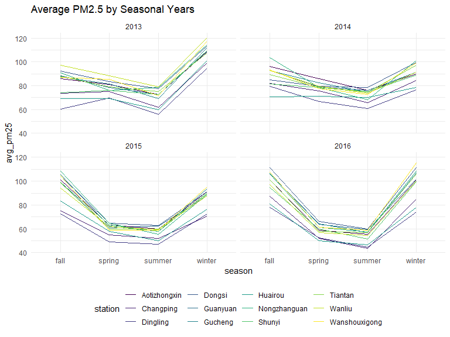

R Notebook
================

``` r
library(tidyverse)
```

``` r
#setwd("./PRSA_Data_20130301-20170228")
files = list.files("./PRSA_Data_20130301-20170228", full.names = TRUE)

all<-map_df(files, read_csv) %>% 
  bind_rows() %>% 
  janitor::clean_names()
```

Average PM 25 by year for all stations

``` r
all %>%  
  group_by(year) %>% 
  summarize(avg_pm25=mean(pm2_5, na.rm = TRUE)) %>% 
  ggplot(aes(x=year, y=avg_pm25)) +
  geom_line()
```



Average PM 25 by year for each station

``` r
all %>%  
  group_by(year, station) %>% 
  summarize(avg_pm25=mean(pm2_5, na.rm = TRUE)) %>% 
  ggplot(aes(x=year, y=avg_pm25, color=station, group=station)) +
  geom_line()
```



Average PM 25 by year for each station

``` r
all %>%  
  filter(year==2015) %>% 
  ggplot(aes(x=no, y=pm2_5, color=station, group=station)) +
  geom_line()
```

    ## Warning: Removed 10 rows containing missing values (geom_path).


