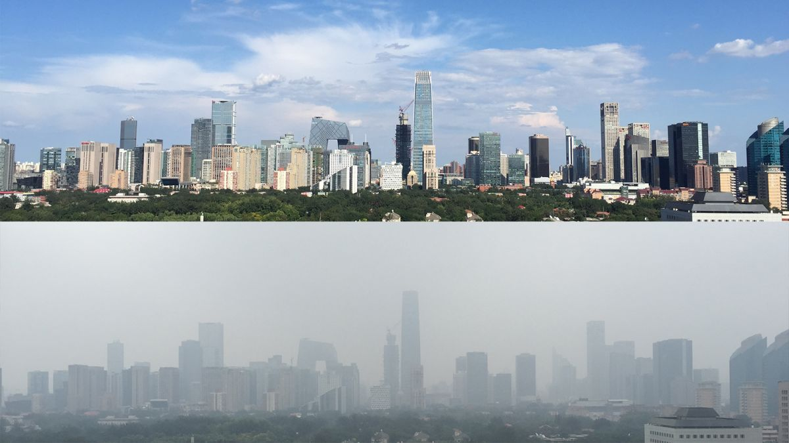

```{r setup, include=FALSE}
knitr::opts_chunk$set(echo = TRUE)
```

## We ball air qual-- Beijing Air Pollution Patrol
</br>

### Project Team:
#### *David DeStephano dd2948, Connor Goldman cg3112, Sarah Munro sim2128, RuiJun Chen rc3179*
</br>

{width=550px}


### Introduction
With the rise of industrialization, air pollution has become an increasingly important (and visible) factor influencing our environment and human health. Beijing, the capital of China and its second-largest city, is home to over 21 million people and has historically struggled with air pollution as the city and surrounding areas rapidly industrialized in recent decades. Beijing has frequently been affected by heavy smog, as seen above, which stems from the burning of fossil fuels, industrial plants, cars, as well as its proximity to the Gobi desert and intermittent sandstorms. In preparation for the global spotlight on Beijing for the 2008 Summer Olympics, China began making large strides in both measuring and improving air quality, which started with the public reporting of fine particulate matter (PM)10, followed by PM2.5.
<br>

### Project Overview
As our team is made up of public health students and physicians, we have a vested interest in understanding and improving the health of populations. We believe that governments should maintain tools for assessing dynamic health and environmental indicators over time, including air quality data. The purpose of this project is to create an interactive tool and data source that integrates weather and pollution over time in such a way that could be utilized and disseminated by a government or health agency. We sought to develop analyses that explore the association between meteorological indicators and pollution, as well as with health outcomes such as cardiovascular disease.


