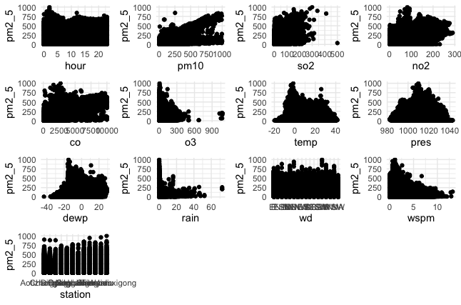

```{r setup, include=FALSE}
library(tidyverse)
library(modelr)
library(gridExtra)

knitr::opts_chunk$set(
	echo = TRUE,
	warning = FALSE,
	fig.width = 8, 
  fig.height = 6,
  out.width = "90%"
)
options(
  ggplot2.continuous.colour = "viridis",
  ggplot2.continuous.fill = "viridis"
)
scale_colour_discrete = scale_colour_viridis_d
scale_fill_discrete = scale_fill_viridis_d
theme_set(theme_minimal() + theme(legend.position = "bottom"))
```

*David DeStephano dd2948, Connor Goldman cg3112, Sarah Munro sim2128, RuiJun Chen rc3179*
*Dec 5, 2019*

<br>

# Motivation

Human health is inextricably linked to the quality of the air we breath we every day. Outdoor air comprises a significant portion of our lifetime air exposure, and the quality of that air has been declining for some time. Air pollution is increasingly recognized as a factor contributing to global morbidity and mortality, particularly with respect to cardiovascular and respiratory health. In 2018, The World Health Organization released a report stating that:

	→ 91% of the world population lived in places where WHO air quality guidelines were not met 
	→ Air pollution was estimated to cause 4.2 million premature deaths worldwide in 201
  → Reduction in pollution would reduce the global burden of disease from heart disease, stroke, lung cancer, and chronic and acute respiratory diseases 

**From [WHO](https://www.who.int/news-room/fact-sheets/detail/ambient-(outdoor)-air-quality-and-health)

# Goals
There is a long way to go in improving ambient air quality, but there is a lot to be gained in doing so. Improved monitoring of factors that influence pollution, and increased awareness of associated health risks can advance the road to recovery. Through this project we strive to:

	→ Replicate an air quality monitoring system that could be utilized by a government or health entity 
	→ Assess meteorological data as a predictor of air quality
	→ Identify temporal trends, if any 
	→ Look for associations between air quality and cardiovascular health 

# Related Work
After finding the dataset, we performed a literature review and were inspired by several studies to examine predictors of PM 2.5 and whether pollutants affect CVD hospitalizations.

# Initial Questions


# Our Data
Beijing is one of the industrial capitals of the world, and a notorious source of air pollution. For our primary analyses we looked at a dataset describing meteorological and air quality data from 12 sites in Beijing, China over the years 2013 - 2017. This data comes from ________. Air quality was measured as a concentration of particulate matter 2.5 (PM2,5) and particulate matter 10 (PM10). PM2.5 is associated with greater health risks, because the smaller size (<2.5um) makes it more efficient at penetrating deeper into the respiratory system. For this reason we chose to analyze PM2.5 as the outcome of interest. (https://www3.epa.gov/ttn/amtic/files/ambient/pm25/spec/drispec.pdf). For our secondary analyses, we sought to isolate any associations between air quality and health outcomes in Beijing. We modeled cardiovascular disease as the outcome, using data from _______. 
The data can also be downloaded on http://archive.ics.uci.edu/ml/datasets/Beijing+Multi-Site+Air-Quality+Data
No: row number
year: year of data in this row
month: month of data in this row
day: day of data in this row
hour: hour of data in this row
PM2.5: PM2.5 concentration (ug/m^3)
PM10: PM10 concentration (ug/m^3)
SO2: SO2 concentration (ug/m^3)
NO2: NO2 concentration (ug/m^3)
CO: CO concentration (ug/m^3)
O3: O3 concentration (ug/m^3)
TEMP: temperature (degree Celsius)
PRES: pressure (hPa)
DEWP: dew point temperature (degree Celsius)
RAIN: precipitation (mm)
wd: wind direction
WSPM: wind speed (m/s)
station: name of the air-quality monitoring site

# Exploratory Analysis
### Loading and tidying the data
We loaded the data from csv files obtained from the data archive listed above

```{r, results='hide', message=FALSE}
files = list.files("./PRSA_Data_20130301-20170228", full.names = TRUE)

all_df = map_df(files, read_csv) %>% 
  bind_rows() %>% 
  janitor::clean_names()
```

We identified a total of `r all_df %>% nrow()` rows/observations, and a total of `r all_df %>% ncol()` variables or columns which include the following: `r all_df %>% tbl_vars()`. We then wanted to characterize the amount of data present and missing for each variable:

Total amount of data:
```{r}
colSums(!is.na(all_df))
```

Amount of missing data for each variable:
```{r}
colSums(is.na(all_df))
```

From this, it appears that all observations(rows) have date, time, and station information. The number of complete observations with all variables filled in is `r all_df %>% complete.cases() %>% sum` which represents the vast majority of the observations. 

In tidying the data, we found there is a column/variable 'no' which just seems to count rows, which is not needed and removed. We also changed wd and station into factors, added seasons, and created a variable for seasonal years (since winter spans over two years, this variable was created to only be coded as the year in which winter began). Date and datetime variables were also created.
    
```{r}
all_df = 
  all_df %>% 
  select(-no) %>% 
  mutate(
    wd = as.factor(wd),
    station = as.factor(station),
    date = as.Date(str_c(year, '-', month, '-', day)),
    datetime = as.POSIXct(str_c(year, '-', month, '-', day, ' ', "00:", hour,":00")),
    season = case_when(
      (month < 3) ~ "winter", #start of Spring is 3/20
      (month == 3 & day < 20) ~ "winter",
      (month < 6) ~ "spring", #start of Summer is 6/21
      (month == 6 & day < 21) ~ "spring",
      (month < 9) ~ "summer", #start of Fall is 9/22
      (month == 9 & day < 22) ~ "summer",
      (month < 12) ~ "fall", #start of Winter is 12/21
      (month == 12 & day < 21) ~ "fall",
      (month == 12 & day >= 21) ~ "winter"
    ),
    seasonal_year=if_else(month<4 & season=="winter" & year ==2014, 2013,
                          if_else(month < 4 & season=="winter" & year ==2015, 2014,
                           if_else(month < 4 & season=="winter" & year ==2016, 2015,
                            if_else(month < 4 & season=="winter" & year ==2017, 2016, year)))),
    season_and= paste(season, " ", seasonal_year)
  )
```

Visualizing the missing data over time
```{r}
missing = all_df %>% 
  select(-year, -season, -seasonal_year, -season_and, -datetime, -month, -day, -hour) %>% #the original data except the ones we know are complete
  is.na() %>% 
  as_tibble() %>% 
  mutate(
    date = all_df$date,
    station = all_df$station
  ) %>% 
  pivot_longer(
    cols = pm2_5:wspm
  ) 

missing %>% 
  ggplot(aes(x =date, y = name, fill = value)) + 
  geom_raster(alpha=0.8) + 
  scale_fill_discrete(name = "", labels = c("Present", "Missing")) +
  labs(x = "Variable",y = "Date", title = "Missing values over time") +
  coord_flip() 
```

And now visualizing missing data over time across stations:
```{r}
missing %>% 
  ggplot(aes(x =date, y = name, fill = value)) + 
  geom_raster(alpha=0.8) + 
  scale_fill_discrete(name = "", labels = c("Missing", "Present")) +
  labs(x = "Time",y = "Variable", title = "Missing values over time by station") +
  facet_grid(station~.) 
```

Our primary outcome of interest is PM2.5, and can be summarized as follows:
`r all_df %>% pull(pm2_5) %>% summary`

Looking at PM2.5 over time:
```{r}
all_df %>% 
  ggplot(aes(x = date, y = pm2_5)) +
  geom_point() +
  geom_smooth()
```

Looking at PM2.5 over time by station:
```{r}
all_df %>% 
  ggplot(aes(x = date, y = pm2_5)) +
  geom_point() +
  geom_smooth() +
  facet_grid(~station)
```

Looking at PM2.5 by seasons:
```{r}
all_df %>% 
  mutate(
    fct_reorder(season, pm2_5)
  ) %>% 
  ggplot(aes(x = season, y = pm2_5)) + 
  geom_boxplot()
```

Kind of hard to distinguish, will try limiting scale of y-axis and try a violin plot
```{r}
all_df %>% 
  mutate(
    fct_reorder(season, pm2_5)
  ) %>% 
  ggplot(aes(x = season, y = pm2_5)) + 
  geom_boxplot() + 
  ylim(0, 250)

all_df %>% 
  mutate(
    fct_reorder(season, pm2_5)
  ) %>% 
  ggplot(aes(x = season, y = pm2_5)) + 
  geom_violin() + 
  ylim(0, 250)
```
Overall seems fairly similar across seasons, but technically highest in the winter with a number of very high outlier values as well

Average PM 25 by year for all stations
```{r}
all_df %>%  
  group_by(year) %>% 
  summarize(avg_pm25=mean(pm2_5, na.rm = TRUE)) %>% 
  ggplot(aes(x=year, y=avg_pm25)) +
  geom_line()
```


Average PM 25 by year for each station
```{r}
all_df %>%  
  group_by(year, station) %>% 
  summarize(avg_pm25=mean(pm2_5, na.rm = TRUE)) %>% 
  ggplot(aes(x=year, y=avg_pm25, color=station, group=station)) +
  geom_line()
```

Average PM 25 by year and season for each station
```{r}
all_df %>%  
  group_by(season, seasonal_year, station) %>% 
  summarize(avg_pm25=mean(pm2_5, na.rm = TRUE)) %>% 
  ggplot(aes(x=season, y=avg_pm25, color=station, group=station)) +
  geom_line()+
  facet_wrap(seasonal_year~.) +
  ggtitle("Average PM2.5 by Seasonal Years")
```

Average PM 25 by year and season for each station
```{r}
all_df %>%  
  mutate(season_and=factor(season_and, levels = c("spring   2013", "summer   2013", "fall   2013", "winter   2013",
                                                  "spring   2014", "summer   2014", "fall   2014", "winter   2014",
                                                  "spring   2015", "summer   2015", "fall   2015", "winter   2015",
                                                  "spring   2016", "summer   2016", "fall   2016", "winter   2016"))) %>% 
  group_by(season_and, station) %>% 
  summarize(avg_pm25=mean(pm2_5, na.rm = TRUE)) %>% 
  ggplot(aes(x=season_and, y=avg_pm25, color=station, group=station)) +
  geom_line()+
  ggtitle("Average PM2.5 by Seasonal Years") +
  theme(axis.text.x = element_text(angle = 45, hjust = 1))
```

```{r}
#need to change wspm to CUMULATIVE wind speed for month or direction
all_df %>%  
  filter(station=="Dingling") %>% 
  ggplot(aes(x=dewp, y=wspm, color=pm2_5)) +
  geom_point(alpha=0.10) +
  scale_color_gradient(low="blue", high="red")

```

## Motherload of all scatterplots (Plotting everything )
Looking at scatter plots of every variable against PM2.5 to look for potential correlation
```{r, eval=FALSE} 
## Just FYI, this takes a long time to run. And the plots will take up 900MB of memory
#So for now I've set eval=false, but I'm pushing the image it generated, called all_variables_plot.png
par(mfrow = c(4, 5))

vars = all_df %>% select(-pm2_5, -year, -month, -day, -date, -season) %>% colnames()
plots = list()
for (i in 1:length(vars)) {
  plots[[i]] = ggplot(all_df, aes_string(x = vars[i], y = "pm2_5")) + geom_point()
}
do.call(grid.arrange, plots)
```
{width=600px}

Variables which seem correlated with PM2.5 include (not surprisingly) PM10, but also rain, wind speed, o3 all seem to be strongly correlated. In addition, no2, so2, and possibly temperature, pressure and dew point but in a non-linear fashion

## Findings
We looked at correlations between PM2.5 and the meteorological variables, including dewpoint, windspeed...
Correlations..
Scatterplots
Spearman's correlation coefficients to evaluate the inter-relations between air pollutants and weather conditions
Ray
 
# Additional Analysis
Three models were developed for analysis of weather conditions and their association with PM2.5. A multivariable linear regression, a mixed model, and a Mixed Model for Longitudinal Continuous Data were developed to examine the variables of interest.

Almost every variable is significant, however, station, windspeed, season, and windspeed all have high effect sizes.
Rain, dewpoint, temp also have moderate effect sizes
 
CVD model… whatever we decide on
IS pm 2.5, season, and CO associated with CVD?
Poisson regression..
	Use the following articles:
		https://journals.plos.org/plosone/article?id=10.1371/journal.pone.0204706
https://www.nature.com/articles/7500453.pdf?origin=ppub

	
# Discussion
Insights
